<div align="center">
  
</div>

# Email Harvest

[](https://python.org)
[](LICENSE)

> **OSINT email harvester — guess corporate formats, scrape web pages, harvest from GitHub orgs, and search crt.sh.**

## Usage

```bash
# Generate email guesses from name list
python email_harvest.py guess example.com --names names.txt

# Scrape emails from a webpage
python email_harvest.py scrape https://example.com/about https://example.com/team

# Harvest emails from a GitHub org
python email_harvest.py github target-org --token $GITHUB_TOKEN

# Search crt.sh certificate data for emails
python email_harvest.py crtsh example.com
```

## Disclaimer

> **Authorized security testing only.** For use in bug bounty programs and authorized red team engagements.

## Author

**Omar Khalid** — [omareldemery.com](https://omareldemery.com) | [@amooryx](https://github.com/amooryx)
